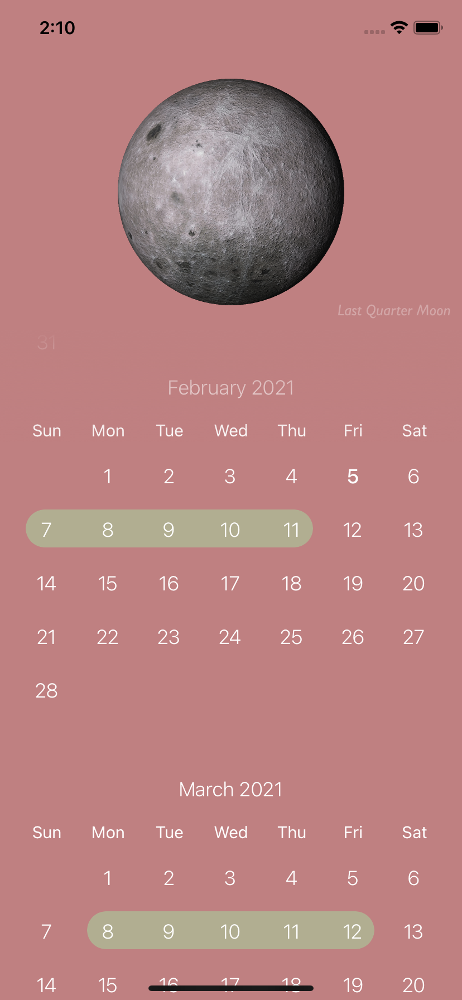

A react-native app that is currently in the process of being a menstrual tracking calendar. This app also includes a THREE.js moon that was transferred from THREE.js to react-native with the help of the expo-three library. This moon showcases the moon phases in real-time, and also a forecast of the phases that the moon will through in the weeks to be marked.

